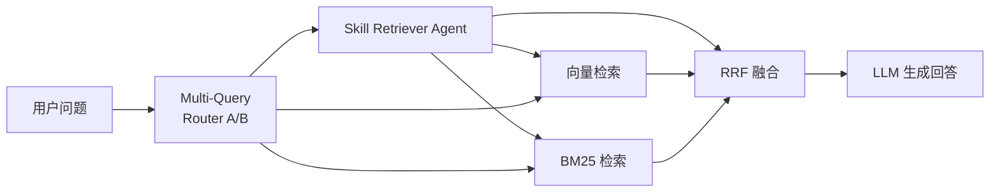

# Mini-OpenClaw RAG

本地运行、文件优先、可审计的 RAG Agent 工作台。

- 对话、工具调用、检索过程都落到本地文件
- 长期记忆使用可直接编辑的 Markdown
- 技能不是黑盒函数，而是可读可改的 `SKILL.md`
- 前端可以直接看到流式回复、工具链路和检索证据

---

## 项目特点

- **本地优先**：后端和前端都可以直接本地启动
- **Redis 可选**：会话热存储 + 用户偏好动态更新（不装也能正常跑）
- **Multi-Query 检索**：口语自动改写、复杂问题自动拆分，提高召回率
- **父子 Chunk + 上下文窗口**：句子边界切分 + 命中后扩展，避免信息碎片化
- **自动上下文压缩**：对话过长时 DeepSeek Flash 自动摘要，无需手动操作
- **Prompt 可解释**：系统提示词由多个文件实时组装
- **技能可审计**：每个技能都是 `skills/*/SKILL.md`
- **检索可观测**：前端展示知识检索步骤、证据来源和工具调用

## 当前能力

- FastAPI + SSE 流式聊天
- 会话持久化（Redis 热层 + JSON 文件冷层）
- 用户偏好动态更新（Redis Hash，替代静态 USER.md）
- 长期记忆：`backend/memory/MEMORY.md` + 向量检索
- RAG 模式切换
- 本地知识库检索（Skill Agent → Multi-Query → Vector + BM25 → RRF 融合）
- 前端三栏工作台
- 在线编辑 Memory / Skills / Workspace 文件

当前内置技能：

- `rag-skill`：本地知识库检索
- `web-search`：联网搜索
- `get_weather`：天气查询
- `retry-lesson-capture`：失败经验沉淀

## 知识库检索链路

当前实现了一条"Skill 优先，Multi-Query 兜底"的知识检索链路：



- **Multi-Query**（始终执行）：A 路由（口语/模糊）→ 主改写 + 同义改写 2 条；B 路由（对比/多部分）→ 子查询拆分
- **父子 Chunk**：句子边界切分，命中后上下文窗口扩展
- **RRF 融合**：Skill + 多路 Vector + 多路 BM25 证据汇聚

## 系统结构

```text
├─ backend/
│  ├─ api/                    # Chat、session、file、token、knowledge index 接口
│  ├─ cache/                  # Redis 客户端 + 用户偏好
│  ├─ graph/                  # Agent、prompt、session、memory 相关逻辑
│  ├─ knowledge/              # 仓库内置示例知识库
│  ├─ knowledge_retrieval/    # 检索链路：Skill → Multi-Query → Hybrid → RRF
│  ├─ memory/                 # 长期记忆文件 MEMORY.md
│  ├─ scripts/                # 评测脚本（离线 BM25）
│  ├─ sessions/               # 会话历史（JSON + Redis）
│  ├─ skills/                 # 技能目录
│  ├─ storage/                # 索引、manifest 等缓存
│  ├─ tools/                  # terminal / read_file / python_repl / fetch_url
│  ├─ workspace/              # SOUL.md / IDENTITY.md（系统提示词组件）
│  └─ app.py                  # FastAPI 入口
├─ frontend/
│  ├─ src/app/                # 页面入口
│  ├─ src/components/         # UI 组件
│  └─ src/lib/                # API 客户端与状态管理
└─ README.md
```

## 技术栈

### 后端

- Python 3.10+
- FastAPI + Uvicorn
- LangChain 1.x + LlamaIndex
- Redis（可选，连接失败自动降级）
- OpenAI-compatible API（百炼 / 智谱 / DeepSeek / OpenAI）

### 前端

- Next.js 14 + React 18 + TypeScript
- Tailwind CSS + Monaco Editor

## 环境变量

示例文件见 [backend/.env.example](backend/.env.example)。最少配置：

```env
LLM_PROVIDER=zhipu
LLM_MODEL=glm-5
ZHIPU_API_KEY=your_key

EMBEDDING_PROVIDER=bailian
EMBEDDING_MODEL=text-embedding-v4
EMBEDDING_API_KEY=your_key

TAVILY_API_KEY=your_key
```

可选配置：

```env
# Redis（不配则纯文件模式）
REDIS_URL=redis://localhost:6379/0

# 摘要压缩用小模型
SUMMARY_MODEL=deepseek-v4-flash
SUMMARY_API_KEY=your_key
SUMMARY_BASE_URL=https://api.deepseek.com

# 模型上下文窗口
MAX_CONTEXT_TOKENS=128000
```

## 快速开始

### 1. 启动后端

```powershell
cd backend
conda activate D:\rag-env
python -m uvicorn app:app --host 127.0.0.1 --port 8004 --reload
```

健康检查：`http://127.0.0.1:8004/health`

### 2. 启动前端

```powershell
cd frontend
cnpm run dev
```

默认地址：`http://localhost:3000`

### 3. 启动 Redis（可选）

```powershell
# 本地 Redis，不配也能正常用
redis-server.exe
```

## 评测

```bash
# BM25 离线评估（不需要 LLM，3 秒）
python backend/scripts/evaluate_faq_retrieval.py
```

## 常用接口

- `GET /health`
- `POST /api/chat`
- `GET /api/sessions`
- `GET /api/knowledge/index/status`
- `POST /api/knowledge/index/rebuild`

## 当前边界

- 适合本地开发和研究，不是生产级 SaaS
- 知识索引启动时首次构建较慢（需调用 embedding API），后续从磁盘加载
- Excel / PDF 依赖技能链路处理
